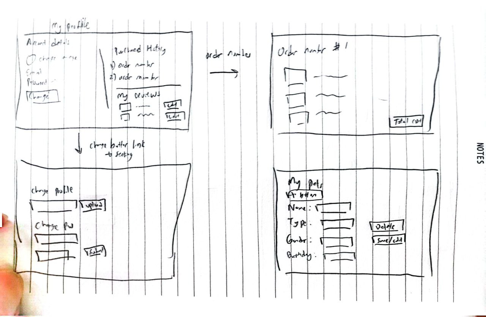

# Pet Mart: Your One-Stop Pet Shop

🐾 Calling All Pet Lovers! Discover Pet Mart - Your Ultimate Pet Shopping Destination! 🛍️

Are you a passionate pet lover, always on the lookout for the finest products to pamper your furry friends? Look no further! [**Pet Mart**](https://petmart-tnfk.onrender.com/) is here to make all your pet dreams come true!

[**Pet Mart**](https://petmart-tnfk.onrender.com/) is an all-inclusive online platform dedicated to pet owners and their furry companions. With a mission to provide convenience, quality, and care, Pet Mart offers an extensive range of pet food, treats, and healthcare items. Whether you have a lovable Labrador, a curious cat, or any other adorable pet, Pet Mart caters to the needs of all pet parents.

[**Pet Mart**](https://petmart-tnfk.onrender.com/) aims to create a delightful shopping experience for pet owners, ensuring that every aspect of their pet's well-being is taken care of. From premium products to user-friendly features, [**Pet Mart**](https://petmart-tnfk.onrender.com/) is the go-to platform for all pet parents, providing convenience, reliability, and love for their cherished companions.

# Features

1. User Authentication (Login and Sign-Up): Pet Mart warmly welcomes both pet enthusiasts and existing users with a seamless and secure login and sign-up process. Existing users can effortlessly log in using their email and password, while newcomers can create a new account by providing essential details like their name, email, and password.

2. Diverse Product Collection: Explore an extensive array of premium pet food, treats, and healthcare items showcased on Pet Mart's product listing page. We take pride in curating products that adhere to the highest quality standards, ensuring the well-being and happiness of your beloved pets.

3. Easy Browsing with Smart Filters: Navigate with ease through our intuitive filter options, empowering you to find the perfect products for your pets. Filter by sought-after brands, distinct categories (food, treats, or healthcare), and various pet types (dogs and cats) to discover tailored recommendations.

4. Effortless Shopping Cart: Enjoy a hassle-free shopping experience as you add your desired products to the cart. Modify quantities, review your selections, and proceed to a smooth checkout, making your pet's delight just a click away.

5. Ratings and Reviews: Share your invaluable experiences and insights by providing honest ratings and reviews for purchased products. Empower fellow pet owners to make well-informed decisions and uncover the finest products for their furry companions.

6. Personalized Favorites: Heart your most cherished products as favorites, allowing you to easily revisit and access them whenever you return to Pet Mart. Your pets' favorites are just as precious to us!

7. Tailored Pet Profiles: Craft personalized profiles for your adorable pets, adding essential details such as their names, breeds, and ages. Managing your pets' information has never been more delightful.

8. Account Control and Profile Settings: Experience complete control over your account settings, including the option to update passwords and upload profile pictures. Pet Mart prioritizes the security and convenience of your account.

9. Admin Inventory Management: Pet Mart empowers administrators with comprehensive inventory management capabilities. Admins have the authority to edit remaining stock and price for products, ensuring accurate and up-to-date information is presented to customers. This feature enables seamless control over product availability and pricing, guaranteeing a smooth shopping experience for all pet owners. Administrators can create an account ending with "@admin.com" to access the inventory management capabilities.

Embark on a delightful journey with Pet Mart, where you'll find an abundance of joyous moments and extraordinary pet products. Discover the love and happiness that come with being part of the Pet Mart family! 🐾🛍️

# Ideation & Project Planning

# Technologies Used, Tech Stack

MERN Stack

HTML, CSS and Javascript
React, Express, Node & MongoDB

Libraries: mui, antd

# Getting Started

🎉 Join the [**Pet Mart**](https://petmart-tnfk.onrender.com/) Family Today! 🎉

If you're a devoted pet lover who yearns to explore the finest pet products in town, don't wait any longer! Head over to [**Pet Mart**](https://petmart-tnfk.onrender.com/) now and embark on an extraordinary adventure that celebrates the love and joy pets bring to our lives.

🐾 [**Pet Mart**](https://petmart-tnfk.onrender.com/) - Where Pet Dreams Come True 🐾

# Images

Images are taken from Google. All rights belong to the original artists and owners.
